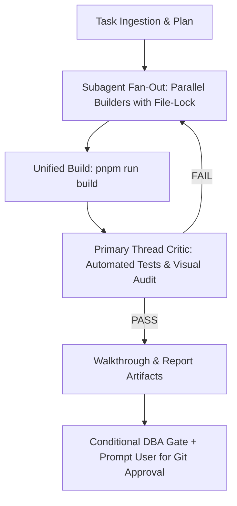

# Mandatory TDD & Subagent Verification Workflow

Every engineering task must follow the systematic Quality-Driven process:

## 1. Subagent Fan-Out with File-Lock Protocol
- Decompose complex features across specialized builder subagents (`Model: 'flash'`).
- **File-Lock Guarantee**: Every builder subagent receives explicit, disjoint file paths. No two subagents may edit the same file simultaneously.
- If overlap is unavoidable, assign one subagent as primary owner; secondary subagents return instructions to the orchestrator for sequential merge.

## 2. Independent Builder Verification
- Each builder must run localized build and syntax checks before sending its completion report.

## 3. High-Reasoning QA Critic (Primary Thread)
- Primary thread consolidates builder outputs, runs unified compilation (`pnpm run build`), executes automated E2E browser scripts, and captures high-resolution screenshots.
- Issues a formal `PASS` / `FAIL` verdict before presenting work to the user.

## 4. Visual Proof & Walkthrough
- Save high-resolution verification screenshots to the artifact directory.
- Present responsive screenshot carousels and structured Pass/Fail tables in `walkthrough.md`.
