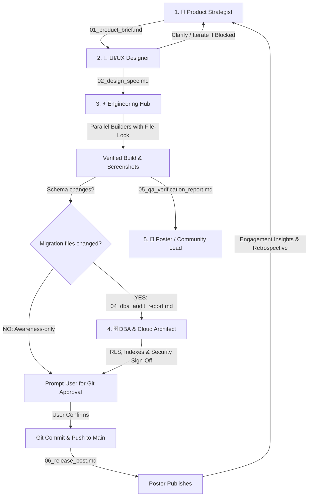

# 📦 5-Node Multi-Agent Lifecycle & Engineering Flow Porting Guide

This guide details how to export and replicate the **5-Node Multi-Agent Lifecycle Protocol**, **Parallel Subagent File-Locking**, **TDD Critic Verification**, and **Handoff Artifact Architecture** across any new or existing project.

---

## 🏗️ Architecture Overview

The 5-Node flow structures collaborative AI and human pair programming across five specialized roles:



---

## 🚀 Fast Porting (1-Command Installer)

We have created an automated export utility script: [`scripts/export-flow.sh`](file:///Users/markhuelgas/Documents/antigravity/ag-brgy-connect/scripts/export-flow.sh).

### Syntax:
```bash
./scripts/export-flow.sh <target-project-directory> [options]
```

### Options:
* `--name <project-name>`: Project display name
* `--framework <framework>`: Frontend or fullstack framework (e.g. `"Next.js 15"`, `"TanStack Start"`, `"Vite React"`, `"SvelteKit"`)
* `--db <db-engine>`: Database & ORM (e.g. `"Supabase PostgreSQL"`, `"Prisma"`, `"Drizzle"`, `"None"`)
* `--build <build-command>`: Project build command (default: `"pnpm run build"`)

### Example Usage:

```bash
# Export to a Next.js full-stack app
./scripts/export-flow.sh /path/to/my-nextjs-app \
  --name "CivicPortal" \
  --framework "Next.js 15 (App Router)" \
  --db "Supabase PostgreSQL & RLS" \
  --build "pnpm run build"

# Export to a lightweight Vite SPA
./scripts/export-flow.sh /path/to/my-vite-app \
  --name "MerchantDashboard" \
  --framework "Vite React SPA" \
  --db "None" \
  --build "npm run build"
```

---

## 📂 Export Package File Structure

When exported, the target repository will contain the following standalone modular structure:

```
target-repo/
├── AGENTS.md                                # Root operational protocol and 5-node guidelines
├── .agents/
│   ├── rules/
│   │   ├── tdd-workflow.md                  # Subagent fan-out, file-lock guarantee & QA critic
│   │   ├── git-approval-gate.md             # Mandatory human approval gate before git commit/push
│   │   └── db-migration-gate.md             # Conditional blocking DBA audit on schema changes
│   └── templates/subagents/
│       ├── builder_template.md              # Reusable system prompt for parallel builder subagents
│       └── critic_qa_template.md            # Reusable system prompt for QA critic subagents
└── handoffs/
    └── template/
        ├── 01_product_brief.md              # Stage 1 Product brief template
        ├── 02_design_spec.md                # Stage 2 UI/UX design specification template
        ├── 03_implementation_plan.md        # Stage 3 Engineering implementation plan template
        ├── 04_dba_audit_report.md           # Stage 4 DBA security & RLS audit template
        ├── 05_qa_verification_report.md     # Stage 5 QA matrix & screenshot verification template
        └── 06_release_post.md               # Stage 6 Community release announcement template
```

---

## 🔒 The File-Lock Subagent Protocol (Key Rule)

When breaking down tasks for parallel subagent execution (`invoke_subagent`):

1. **Disjoint Ownership**: No two builder subagents may be assigned the same file path.
2. **Explicit Assignment**: Each subagent's system prompt must list its locked files:
   ```markdown
   Your locked files are:
   🔒 src/components/layout/Navbar.tsx
   🔒 src/components/layout/Footer.tsx
   ```
3. **Overlapping Dependencies**: If two subagents must touch the same file, appoint one subagent as primary owner; the secondary subagent returns code snippets/instructions for the primary orchestrator to apply sequentially.
4. **Independent Validation**: Every builder must run localized build validation before reporting completion.
5. **Primary Thread Critic**: The primary thread runs unified compilation (`pnpm run build`), browser automation tests, and visual screenshot audits.

---

## 🛡️ The 2 Immutable Gates

### 1. Conditional DBA Migration Gate
- **Detection**: Check if migration files changed (`git diff --name-only | grep -E '(migrations|schema)'`).
- **If YES**: Node 4 (DBA) performs full RLS, indexing, and idempotency audit and signs off in `04_dba_audit_report.md` before prompting the user.
- **If NO**: DBA is notified for awareness only (non-blocking).

### 2. Mandatory Git Approval Gate
- **AI agents MUST NEVER commit or push automatically.**
- All builds, E2E tests, and screenshot walkthroughs must be presented to the user.
- Ask the user directly with the proposed Conventional Commit message and wait for explicit confirmation.
